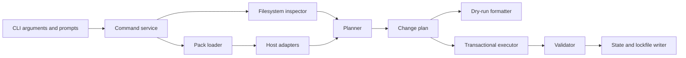

# Agents Pack MVP development plan

**Status:** Lifecycle MVP complete; Phases 0–9 reviewed  
**Last updated:** 2026-07-25  
**Related specification:** [Agents Pack lifecycle MVP](./agents-pack-lifecycle-mvp.md)

## 1. Goal

Build the smallest working Agents Pack implementation that can:

1. install stub instructions and a stub skill;
2. report whether the installation is clean;
3. update from local fixture pack `0.1.0` to `0.2.0`;
4. detect and refuse to overwrite drift;
5. recover from a failed update; and
6. safely eject managed content.

The implementation is complete only after the filesystem tests pass and the stub content is discovered by real Claude Code, Codex, and Cursor sessions.

## 2. Recommended implementation stack

Use:

- **Bun** as the development runtime, package manager, test runner, and initial executable builder;
- **TypeScript** for the CLI and core;
- built-in filesystem, path, cryptography, and temporary-directory APIs wherever practical;
- one small TOML parser;
- one small CLI argument/prompt library; and
- no database.

Pin all dependency versions. Do not add a framework, ORM, dependency-injection container, update client, UI library, or logging platform.

This recommendation is for the lifecycle prototype. We should not schedule a Rust rewrite in advance. Revisit the implementation language only if the prototype reveals a concrete problem with distribution, startup, filesystem reliability, security, performance, or a future desktop shell.

### 2.1 Pre-implementation decisions

The following behaviors are fixed before coding begins:

1. The CLI and package working name is `agents-pack`.
2. The workspace will become a Git repository with `main` as its initial branch.
3. Mutating commands prompt in a TTY and default to **No**.
4. A mutating command in a non-interactive shell requires `--yes`; otherwise it exits without writing.
5. `--dry-run` never requires confirmation and never writes.
6. Only one mutating operation may run in a scope at a time.
7. Multi-file mutations use a persistent transaction journal so a terminated process can be recovered on the next mutating run.
8. `status` remains read-only. If recovery is required, it reports the unfinished transaction and tells the user to rerun the interrupted mutating command.
9. The MVP writes regular files, not symlinks.
10. Pack sources and target paths must remain inside their resolved pack or scope roots.
11. Existing symlinks are accepted only when their canonical destination remains inside the allowed root; a symlink at the final managed file path is an ownership conflict.
12. Existing shared-file permissions are preserved when editing `AGENTS.md`.

No remaining product decision blocks Phase 0. Parser and prompt packages can be selected during scaffolding, then pinned.

The operation lock is an exclusively created file:

```text
Repository: <repository-root>/.agents-pack.operation.lock
Global:     <user-home>/.agents-pack.operation.lock
```

It records the process ID, command, start time, and transaction ID. The lock is acquired before a mutating command inspects or plans filesystem changes and released on clean exit.

Persistent transaction journals live at:

```text
Repository: <repository-root>/.agents-pack/transactions/<transaction-id>/
Global:     <user-home>/.agents-pack/transactions/<transaction-id>/
```

Creating coordination and recovery metadata is not considered a managed-content write. If initialization fails, newly created empty state directories are removed.

## 3. Architecture rule

The CLI must be a thin wrapper around testable library functions.



Important boundaries:

- Adapters return desired file content; they do not write files.
- The inspector reads current state; it does not decide what to change.
- The planner produces a complete change plan; it does not apply it.
- Dry-run and real execution receive the same plan.
- Only the transactional executor mutates the filesystem.
- Configuration and lockfiles are written after target outputs validate.
- Interactive prompts never exist inside the core library.

## 4. Proposed source layout

```text
agents-pack/
├── src/
│   ├── cli/
│   │   ├── main.ts
│   │   ├── arguments.ts
│   │   ├── prompts.ts
│   │   └── output.ts
│   ├── commands/
│   │   ├── init.ts
│   │   ├── status.ts
│   │   ├── update.ts
│   │   └── eject.ts
│   ├── core/
│   │   ├── types.ts
│   │   ├── errors.ts
│   │   ├── paths.ts
│   │   ├── pack.ts
│   │   ├── state.ts
│   │   ├── hash.ts
│   │   ├── inspect.ts
│   │   ├── plan.ts
│   │   └── validate.ts
│   ├── adapters/
│   │   ├── claude.ts
│   │   ├── codex.ts
│   │   ├── cursor.ts
│   │   └── skills.ts
│   └── filesystem/
│       ├── reader.ts
│       ├── managed-block.ts
│       ├── operation-lock.ts
│       ├── recovery.ts
│       ├── transaction.ts
│       └── atomic-write.ts
├── fixtures/
│   └── packs/
│       ├── 0.1.0/
│       └── 0.2.0/
├── tests/
│   ├── unit/
│   ├── integration/
│   ├── fixtures/
│   └── helpers/
├── package.json
├── tsconfig.json
└── bun.lock
```

The exact filenames may change. The boundaries should not.

## 5. Core data types

Define these contracts before implementing commands.

### 5.1 Scope and targets

```ts
type Scope = "global" | "repository";
type AgentTarget = "claude" | "codex" | "cursor";

interface PathContext {
  cwd: string;
  userHome: string;
}
```

Tests inject `userHome`. Core code must not read the real home directory directly after the path context is constructed.

### 5.2 Pack

```ts
interface PackManifest {
  schemaVersion: 1;
  id: string;
  version: string;
  components: PackComponent[];
}

interface PackComponent {
  id: string;
  kind: "instruction" | "skill";
  source: string;
  targets: AgentTarget[];
}
```

### 5.3 Desired output

```ts
type DesiredOutput =
  | {
      kind: "file";
      componentId: string;
      adapter: AgentTarget;
      path: string;
      bytes: Uint8Array;
    }
  | {
      kind: "managed-block";
      componentId: string;
      adapter: "codex";
      path: string;
      blockId: string;
      bytes: Uint8Array;
    };
```

### 5.4 Inspection result

```ts
type ManagedStatus = "absent" | "clean" | "missing" | "modified" | "malformed";

interface InspectedOutput {
  output: LockedOutput;
  status: Exclude<ManagedStatus, "absent">;
  currentHash?: string;
  currentBytes?: Uint8Array;
  blockBytes?: Uint8Array;
}

interface InspectedDestination {
  desired: DesiredOutput;
  status: "absent" | "shared-file";
  existingBytes?: Uint8Array;
}
```

### 5.5 Change plan

```ts
type ChangeOperation =
  | { kind: "create-file"; path: string; bytes: Uint8Array }
  | { kind: "replace-file"; path: string; bytes: Uint8Array }
  | { kind: "remove-file"; path: string }
  | { kind: "insert-block"; path: string; blockId: string; bytes: Uint8Array }
  | { kind: "replace-block"; path: string; blockId: string; bytes: Uint8Array }
  | { kind: "remove-block"; path: string; blockId: string }
  | { kind: "remove-empty-directory"; path: string };

interface ChangePlan {
  command: "init" | "update" | "eject";
  scope: Scope;
  operations: ChangeOperation[];
  warnings: string[];
}
```

Do not add abstractions for future component kinds until the prototype needs them.

## 6. Development sequence

Each phase ends with a working, testable checkpoint. Do not start the next phase while its exit gate is failing.

### Phase 0: Scaffold and freeze contracts

**Implementation status:** Complete on 2026-07-23.

Build:

- Git repository initialization with `main` as the initial branch;
- Bun and TypeScript project;
- formatting, linting, type-checking, and tests;
- CLI entrypoint with placeholder subcommands;
- shared error types and exit-code convention;
- the core types above; and
- fixture pack directories for `0.1.0` and `0.2.0`.

Decisions:

- source files use UTF-8;
- hashes use SHA-256 over exact bytes;
- paths in manifests and lockfiles use `/` separators;
- state-file schemas begin at version 1; and
- tests use temporary directories only.

Exit gate:

- `bun test` runs;
- type-checking passes;
- all four placeholder commands show help; and
- no command writes to disk.

Verification:

- `bun run check` passes;
- 19 tests pass across 5 test files;
- all four command help surfaces are exercised through the real CLI process; and
- invoking `init` without `--help` returns `NOT_IMPLEMENTED` without writing.

### Phase 1: Pack loader, path resolver, and hashing

**Implementation status:** Complete on 2026-07-24.

Build:

- pack-manifest parsing;
- component source validation;
- rejection of absolute paths and `..` traversal;
- canonical containment checks for pack sources and target paths;
- explicit handling of existing ancestor and final-path symlinks;
- deterministic pack hashing;
- repository-root discovery;
- global and repository state-path resolution;
- injected user-home support; and
- minimal state and lockfile parsing.

Tests:

- valid fixture packs load;
- malformed and unsupported manifests fail clearly;
- missing component files fail;
- traversal attempts fail;
- a pack symlink cannot escape the pack root;
- a target path cannot resolve outside its scope root;
- a final-path symlink is rejected as an ownership conflict;
- identical packs produce identical hashes;
- repository root uses the nearest Git root;
- a non-Git folder uses the current directory; and
- global paths stay under injected `userHome`.

Exit gate:

- both fixture packs load into typed in-memory structures;
- every resolved path is test-covered; and
- no target adapter exists yet.

Verification:

- `bun run check` passes;
- 55 tests pass across 7 test files;
- copied packs produce the same deterministic hash independent of root path;
- unsafe traversal and escaping symlinks are rejected;
- Git directories, Git worktree marker files, and non-Git folders resolve correctly; and
- scope configuration and lockfile schema version 1 parse into typed state.

### Phase 2: Renderers and managed-block parser

**Implementation status:** Complete on 2026-07-24.

Build:

- Claude instruction renderer;
- Codex instruction-block renderer;
- Cursor `.mdc` renderer;
- skill placement matrix;
- exact-byte file rendering;
- managed-block find, insert, replace, and remove operations; and
- malformed, duplicate, and nested marker detection.

Tests:

- golden output for each adapter;
- Cursor-only, Cursor-and-Claude, Cursor-and-Codex, and all-target skill placement;
- insertion into empty and non-empty `AGENTS.md`;
- user text before and after a managed block is preserved;
- marker edits are detected;
- duplicate or malformed blocks fail; and
- removing a clean block preserves surrounding user content.

Exit gate:

- pack `0.1.0` renders the complete desired repository tree in memory;
- pack `0.2.0` produces predictable changes; and
- adapters perform no filesystem writes.

Verification:

- `bun run check` passes;
- 81 tests pass across 9 test files;
- Claude, Codex, and Cursor outputs match checked-in golden files;
- the complete Cursor skill-placement matrix is covered;
- managed-block insertion, replacement, and removal preserve outside bytes exactly;
- malformed, duplicated, nested, mismatched, and edited markers are rejected; and
- both adapter and managed-block modules remain pure and perform no filesystem writes.

### Phase 3: Inspector and planner

**Implementation status:** Complete on 2026-07-24.

Build:

- current-filesystem inspection;
- lock-hash comparison;
- ownership-conflict detection;
- scope-conflict detection;
- plan construction for `init`, `update`, and `eject`;
- stable plan ordering; and
- human-readable plan formatting.

The planner must reject:

- modified or missing managed outputs during update or eject;
- an unowned file at an exact managed destination;
- malformed managed blocks;
- unsupported global Cursor selection; and
- conflicting global/current-repository scope.

Tests:

- clean, absent, missing, modified, malformed, and ownership-conflict cases;
- no-op repeated initialization;
- clean version update;
- user-only edits outside `AGENTS.md` block;
- update drift refusal;
- eject drift refusal; and
- dry-run plan snapshots.

Exit gate:

- every acceptance scenario can produce either a complete plan or a typed error;
- plan creation is read-only; and
- identical input produces identical operation ordering.

Verification:

- `bun run check` passes;
- 101 tests pass across 11 test files;
- init, update, and eject plans match checked-in human-readable golden files;
- repeated init and an update to the already installed immutable pack are no-ops;
- user bytes outside the Codex managed block remain outside the owned hash and survive an update;
- missing, modified, malformed, conflicting, unowned, and unsupported states fail with typed errors;
- lockfiles are compared semantically rather than by JSON object-key order;
- locked output paths are constrained to adapter-owned roots before inspection or removal; and
- planning is read-only and produces stable operation ordering for identical inputs.

### Phase 4: Transactional filesystem executor

**Implementation status:** Complete on 2026-07-24.

Build:

- exclusive per-scope operation lock;
- temporary transaction directory;
- persistent transaction journal with `prepared`, `applying`, and `committed` states;
- snapshots of every file that may change;
- atomic file replacement;
- directory creation tracking;
- operation executor;
- post-write validation;
- restoration after injected failure;
- startup detection and recovery of an unfinished transaction;
- stale-lock detection; and
- cleanup after success or recovery.

Tests:

- successful multi-file plan;
- failure before the first write;
- failure after one file;
- failure during managed-block replacement;
- failure before state write;
- process-termination simulation with an `applying` journal left on disk;
- a second concurrent mutation is rejected while a live operation lock exists;
- a stale lock is reported and safely cleared by the next mutating operation;
- restoration of original files;
- removal of newly created files after failure; and
- no transaction artifacts after success.

Exit gate:

- a deliberately failed version `0.1.0` to `0.2.0` update leaves a byte-for-byte version `0.1.0` installation;
- an unfinished transaction is restored before a new mutation is planned;
- lock and configuration state remain old until all target outputs validate; and
- only the executor contains mutation primitives.

Implemented transaction order:

1. exclusively create the scope operation lock;
2. recover `prepared`, `applying`, or `committed` journals from an earlier process;
3. invoke the planner only after recovery;
4. snapshot every file that the plan may mutate, including modes and backup hashes;
5. durably write the `prepared` journal;
6. durably advance it to `applying`;
7. atomically apply and validate target outputs;
8. apply and validate configuration and lock state last;
9. durably advance the journal to `committed`; and
10. remove transaction data, empty owned directories, and the operation lock.

Verification:

- `bun run check` passes;
- 118 tests pass across 13 test files;
- successful init, update, and eject plans execute through the same transaction engine;
- injected failures before the first write, after one file, before atomic managed-block rename, and before state writes restore the complete prior tree byte-for-byte;
- a failed fresh init removes every newly created file and directory;
- a real child process exits during an `applying` update, leaving a stale lock and persistent journal that the next mutation recovers before replanning;
- `prepared` journals are cleaned without restoration and `committed` journals are cleaned without rollback;
- live operation locks reject concurrent mutation and dead-process locks are quarantined and reported as recovered;
- existing shared-file permissions survive atomic managed-block edits;
- target outputs are validated twice before lifecycle state advances;
- transaction and recovery paths are restricted to explicit Agents Pack-owned roots; and
- successful and recovered operations leave no lock, journal, backup, or atomic-temp artifacts.

### Phase 5: `init` and `status`

**Implementation status:** Complete on 2026-07-24.

Build non-interactive behavior first:

```text
agents-pack init --scope ... --agents ... --pack ... --yes
agents-pack status
```

Then add:

- installation preview;
- confirmation prompt;
- interactive scope selection;
- interactive target selection; and
- clear success and error summaries.

Confirmation rules:

- interactive mutations default to **No**;
- non-interactive mutations require `--yes`;
- dry-run never prompts; and
- `status` never prompts or writes, including when it detects required recovery.

Tests:

- empty repository initialization;
- existing `AGENTS.md` preservation;
- target-specific initialization;
- all-target initialization and warning;
- global Claude and Codex initialization under temporary home;
- global Cursor rejection;
- identical second initialization is a no-op;
- changed second initialization is rejected;
- status reports clean, missing, modified, and malformed;
- non-TTY mutation without `--yes` exits without writing; and
- status reports an unfinished transaction without recovering it.

Exit gate:

- the complete repository and global initialization acceptance tests pass;
- interactive and flag-based commands call the same command service; and
- status never writes.

Implemented command behavior:

- `init --yes` acquires the scope lock, recovers interrupted work, creates and prints the plan, then applies it transactionally;
- `init --dry-run` builds and prints the same plan without locking, recovering, prompting, or writing;
- non-interactive init without `--yes` prints the preview and exits without writing;
- interactive init prompts only for missing scope, agent, and pack values, shows the preview, and defaults confirmation to No;
- an interactively approved plan is rebuilt under the transaction lock and rejected if it changed after approval;
- repeated identical init prints a no-op result;
- `status` reports installed scope, pack, agents, every locked output, warnings, and clean, missing, modified, or malformed state; and
- `status` reports operation locks and `prepared`, `applying`, or `committed` transaction activity without modifying or recovering it.

Verification:

- `bun run check` passes;
- 131 tests pass across 14 test files;
- empty and existing-`AGENTS.md` repositories initialize successfully;
- Claude-only, Codex-only, all-target, global Claude-and-Codex, and unsupported global Cursor paths are covered through real CLI processes;
- all global test writes remain under an injected temporary home;
- repeated identical initialization is a no-op and changed initialization is rejected without writes;
- dry-run, non-TTY refusal, interactive default-No cancellation, and interactive approval are covered;
- status reports clean, missing, modified, malformed, and outside-block user edits correctly; and
- a filesystem snapshot proves status leaves an unfinished `applying` transaction untouched.

### Phase 6: `update`

**Implementation status:** Complete on 2026-07-24.

Build:

- local proposed-pack loading;
- version-change validation;
- dry-run preview;
- clean update planning;
- transactional update;
- target-output validation;
- state and lockfile replacement; and
- clear drift reports.

Tests:

- `0.1.0` to `0.2.0` dry-run changes nothing;
- clean apply updates every output and hash;
- outside-block user text survives;
- file drift stops before writing;
- block drift stops before writing;
- invalid proposed pack stops before writing;
- injected executor failure restores version `0.1.0`; and
- repeated update to the installed version is a no-op.

Exit gate:

- every update acceptance test in the MVP specification passes;
- failed updates preserve the previous installation; and
- the CLI never partially advances state.

Implemented command behavior:

- `update --pack <path> --dry-run` renders the complete update plan without locking, recovering, prompting, or writing;
- `update --pack <path> --yes` detects the installed scope, acquires that scope’s lock, recovers interrupted work, replans, and applies transactionally;
- interactive update prompts for a missing local pack path, previews the plan, defaults confirmation to No, and verifies the approved plan again under the lock;
- non-interactive update without `--yes` previews and exits without writing;
- immutable same-version content changes and packs with the wrong ID are rejected by the planner;
- missing, modified, or malformed managed files and blocks stop before execution;
- state and lockfile replacement remain the final transaction operations; and
- updating to the already installed immutable pack is a no-op.

Verification:

- `bun run check` passes;
- 138 tests pass across 14 test files;
- a real CLI dry-run from fixture `0.1.0` to `0.2.0` leaves the complete repository tree unchanged;
- clean repository and global updates replace instructions, skills, managed-block markers, configuration, hashes, and lock version;
- user text before and after the Codex managed block survives exactly;
- managed-file and managed-block drift both fail before any write;
- invalid proposed packs and non-TTY updates without `--yes` leave the installation unchanged;
- an injected command-service executor failure restores the complete version `0.1.0` tree; and
- repeating update with fixture `0.2.0` returns a deterministic no-op.

### Phase 7: `eject`

**Implementation status:** Complete on 2026-07-24.

Build:

- eject preview;
- managed-file removal;
- managed-block removal;
- safe removal of empty created directories;
- scope-state removal last; and
- preservation of unrelated directories and files.

Tests:

- clean repository eject;
- clean global eject under temporary home;
- dry-run changes nothing;
- user `AGENTS.md` text remains;
- modified managed file refuses ejection;
- malformed managed block refuses ejection; and
- unrelated files in Agents Pack-created parent directories remain.

Exit gate:

- clean repository and global ejection acceptance tests pass;
- dry-run and declined ejection leave byte-identical trees;
- drift always stops before execution; and
- ejection removes only locked outputs, managed regions, and empty lifecycle-state directories; and
- all automated lifecycle acceptance tests pass end to end.

Implemented command behavior:

- `eject --dry-run` prints the exact removal plan without locking, recovering, prompting, or writing;
- `eject --yes` detects the installed scope, locks it, recovers interrupted work, replans, and removes managed content transactionally;
- interactive eject previews the plan, defaults confirmation to No, and verifies the approved plan again under the lock;
- non-interactive eject without `--yes` previews and exits without writing;
- complete managed files are removed while Codex instruction containers lose only their owned separator and block;
- configuration and lock state are removed after target outputs validate;
- lifecycle transaction and state directories are removed only when empty; and
- any missing, modified, or malformed locked output stops ejection.

Verification:

- `bun run check` passes;
- 145 tests pass across 14 test files;
- repository and global ejection execute through real CLI processes;
- dry-run leaves the complete installation byte-identical;
- user text before and after the managed `AGENTS.md` block is restored exactly;
- unrelated user files inside `.claude/rules/agents-pack` survive;
- modified managed files and malformed managed blocks refuse ejection before writes;
- non-TTY refusal and interactive cancellation preserve the complete tree;
- an injected command-service failure restores the complete installation; and
- successful ejection removes scope state while leaving unrelated repository and home content untouched.

### Phase 8: Real-agent conformance

**Implementation status:** Complete on 2026-07-25. Claude Code, Codex, and
Cursor passed repository v1-to-v2 conformance. Claude Code and Codex also passed
global v1-to-v2 conformance. See the
[dated conformance record](./agents-pack-conformance-2026-07-25.md).

Create three disposable repositories:

- Claude-only;
- Codex-only; and
- Cursor-only.

For each:

1. install fixture pack `0.1.0`;
2. start a fresh agent session;
3. verify the stub instruction;
4. invoke the stub skill;
5. update to `0.2.0`;
6. start another fresh session;
7. verify both version-2 behaviors; and
8. record product version and observed differences.

If an agent does not discover an expected file, fix the adapter and add an automated regression test before continuing.

Exit gate:

- every supported repository adapter is verified in the actual product;
- Claude and Codex global adapters are also manually verified; and
- known Cursor multi-root behavior is recorded without expanding MVP scope.

### Phase 9: MVP review

**Implementation status:** Complete on 2026-07-25. The lifecycle prototype is
accepted for the next internal increment but is not approved for public
distribution. See the [MVP review](./agents-pack-mvp-review.md).

Review:

- Was the planner boundary sufficient?
- Were any writes possible outside the executor?
- Did the lockfile contain enough information?
- Was managed-block ownership understandable?
- Did Bun packaging create a real distribution problem?
- Which adapter assumptions failed?
- Is the next increment still the one listed in the MVP specification?

Produce:

- a short implementation report;
- the manual conformance results;
- unresolved technical debt;
- any schema changes required before real content; and
- a go/no-go decision for the next increment.

## 7. Test strategy

### 7.1 Unit tests

Use unit tests for:

- pack parsing;
- path validation;
- root resolution;
- hashing;
- adapter rendering;
- managed-block parsing;
- inspection classification;
- change planning; and
- output formatting.

These tests should use in-memory inputs where possible.

### 7.2 Filesystem integration tests

Use real temporary directories for:

- atomic writes;
- permissions and path behavior;
- symlink and canonical-containment behavior;
- initialization;
- update;
- recovery;
- ejection; and
- global-home isolation.

Each test creates its own directory and performs cleanup. No test assumes the developer's home directory, current agent installation, or repository configuration.

### 7.3 Golden files

Golden files are useful for:

- Claude rule output;
- Codex managed block;
- Cursor `.mdc` output;
- target skill copies;
- lockfiles; and
- dry-run plans.

Normalize dynamic temporary paths before comparing. Do not normalize content hashes or operation ordering.

### 7.4 Manual conformance tests

Manual tests verify discovery behavior that filesystem tests cannot prove. Record:

- agent product and version;
- operating system;
- selected scope and targets;
- exact fixture pack;
- instruction result;
- skill result; and
- warnings or deviations.

## 8. Error and exit behavior

Use stable error categories from the beginning:

| Category | Example |
|---|---|
| Usage | Missing `--scope` in non-interactive mode |
| Invalid pack | Manifest cannot be parsed |
| Unsupported | Global Cursor requested |
| Scope conflict | Global and current repository installations collide |
| Ownership conflict | Unmanaged file occupies a managed destination |
| Drift | Locked file or block was changed |
| Malformed state | Markers or lockfile are invalid |
| Transaction failure | A write failed and recovery ran |
| Recovery required | An earlier mutation ended with an unfinished journal |
| Operation locked | Another process is mutating this scope |
| Validation failure | Written output does not match the plan |

Human output should explain:

1. what failed;
2. which path or component caused it;
3. whether anything changed;
4. whether recovery succeeded; and
5. the next safe action.

Tests may assert typed error codes instead of parsing prose.

## 9. Pull-request or checkpoint breakdown

If work is reviewed incrementally, use these bounded checkpoints:

1. **Scaffold and contracts**
2. **Pack loader and path resolver**
3. **Claude, Codex, Cursor renderers**
4. **Inspector and pure planner**
5. **Transactional executor**
6. **Init and status**
7. **Update**
8. **Eject**
9. **End-to-end and real-agent conformance**

Each checkpoint should leave tests passing. Avoid one large change containing the whole CLI.

## 10. Work that must not sneak into the MVP

Stop and defer work that introduces:

- HTTP clients or a registry API;
- signing or publisher identities;
- SQLite;
- a desktop UI;
- subagent schemas;
- real best-practice authoring;
- third-party packs;
- automatic drift merging;
- a permanent backup browser;
- telemetry;
- self-update;
- plugin, MCP, or hook installation;
- multi-repository discovery; or
- cross-platform packaging.

A missing abstraction for one of these is not a blocker. We should add it when the next increment requires it.

## 11. Implementation invariants

The following must remain true throughout development:

1. No managed-content mutation occurs before a complete plan exists; operation locks and recovery metadata are the only exceptions.
2. Dry-run and apply use the same plan.
3. Adapters never write files.
4. The planner never writes files.
5. Only locked files and managed regions are replaceable.
6. User content outside managed regions is not hashed as Agents Pack content.
7. Drift stops update and eject.
8. State advances only after output validation.
9. Failed transactions restore prior state.
10. Tests never touch real agent configuration.
11. Unsupported behavior fails explicitly.
12. No network is required.
13. A persistent journal makes interrupted mutations discoverable and recoverable.
14. A per-scope lock prevents concurrent mutations.
15. Canonical paths cannot escape their allowed roots.
16. Existing shared-file permissions are preserved.
17. Non-interactive mutation requires explicit `--yes`.

These invariants are more important than the exact class, function, or directory names.

## 12. First implementation session

The first coding session should do only:

1. initialize the Git repository with branch `main`;
2. initialize the Bun and TypeScript project;
3. configure type-checking and tests;
4. create the proposed directory skeleton;
5. add the core types;
6. create both fixture pack directories and their stub content;
7. add placeholder CLI commands and help;
8. write the first pack-loader and path-context tests; and
9. stop once the Phase 0 gate passes.

Do not begin filesystem mutation code in the first session. The contracts and fixtures should be easy to review before they become embedded in command behavior.
