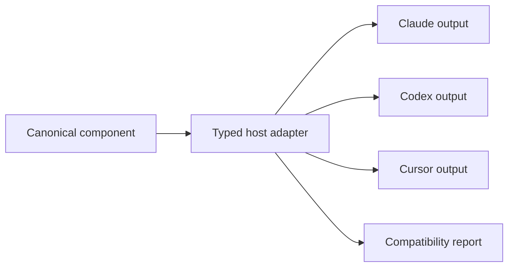

# Agents Pack system design

**Status:** Living design draft  
**Last updated:** 2026-07-27
**Purpose:** Explain, in straightforward language, how Agents Pack should install and maintain shared guidance, skills, subagents, and commands for Claude Code, Codex, and Cursor.

This document records our current product decisions while we continue designing the system. It distinguishes between:

- **Decision:** behavior we currently intend to build.
- **Proposal:** our preferred design, still subject to implementation feedback.
- **Open question:** something that requires a test or another product decision.

The product-specific research behind this design is documented in:

- [Claude Code research](./claude-code.md)
- [Codex research](./codex.md)
- [Cursor research](./cursor.md)
- [Cross-agent comparison](./comparison.md)

The design also borrows selected patterns from [gstack](https://github.com/garrytan/gstack). Section 12 explains which patterns we want and where Agents Pack intentionally differs.

## 1. Decision summary

The first version of Agents Pack will:

1. Be a CLI that can install content either for the current user or for the current repository.
2. Ask the user to choose exactly one installation scope:
   - **Global:** available in every repository on that computer.
   - **Repository:** stored in the current repository and shareable with the team.
3. Install selected Agents Pack instructions, skills, subagents, and manual commands in each selected agent's native format.
4. Keep official Agents Pack content separate from user-owned content.
5. Treat official Agents Pack files as replaceable package files, not as documents users are expected to edit.
6. Let users create or fork their own components when they want to customize an official component.
7. Touch `CLAUDE.md` as little as possible and modify `AGENTS.md` only through one clearly marked managed block when Codex needs startup instructions.
8. Preview every installation and update before it changes files.
9. Detect edits to managed content and stop for an explicit decision instead of attempting a general three-way merge.
10. Keep application updates separate from content-pack updates.

The first version will **not** support a hybrid installation in which the same official Agents Pack component is active globally and in a repository. Hybrid behavior can be designed later after we understand real usage.

## 2. The simple product idea

A user enters a repository and runs:

```text
agents-pack init
```

The CLI first asks:

```text
Where should Agents Pack be installed?

1. Global
   Use Agents Pack in every repository on this computer.
   Recommended for an individual developer.

2. Repository
   Add Agents Pack to this repository so it can be committed and shared.
   Recommended for a team.
```

The CLI then asks which agent systems and components to install, shows the exact files it will create or modify, and asks for confirmation.

After installation, the user can:

- update official Agents Pack content;
- add a new cross-agent skill or subagent once;
- inspect which files are managed;
- detect missing, changed, or incompatible files;
- pin a content-pack version; and
- remove Agents Pack without deleting user-owned configuration.

For automation, the same choice can be supplied directly:

```text
agents-pack init --scope global
agents-pack init --scope repository
```

## 3. The core ownership model

The system becomes much simpler if every file has a clear owner.

### 3.1 Agents Pack-owned content

Official Agents Pack content includes:

- base workflow instructions;
- official skills;
- official subagents;
- manual command skills;
- target-specific adapters; and
- generated manifests or configuration fragments.

Agents Pack may replace these files during an update.

Users can read them, but they should not edit them in place. If a user changes one, Agents Pack detects drift and asks what to do.

### 3.2 User-owned content

User-owned content includes:

- repository-specific text outside an Agents Pack managed block;
- a user's existing `CLAUDE.md` content;
- custom skills and subagents;
- a fork of an official Agents Pack component; and
- agent configuration unrelated to Agents Pack.

Agents Pack never replaces user-owned content during a normal update.

### 3.3 Why this removes most merge complexity

The earlier design assumed that users would regularly edit installed official skills and instructions. That led to a full three-way merge system.

Our updated assumption is:

- users mainly edit `CLAUDE.md` and `AGENTS.md`;
- official skill and subagent files normally remain unchanged; and
- customization should happen in a new user-owned component or fork.

Therefore:

- Claude guidance can usually live in separate automatically discovered rule files;
- Cursor guidance can live in separate project rule files;
- Codex guidance needs one managed block in `AGENTS.md`; and
- official skills and subagents can be replaced as complete files.

This gives users clean ownership without making a merge engine part of the first release.

## 4. The two installation scopes

### 4.1 Global mode

Global mode is for an individual who wants the same Agents Pack behavior in every repository on one computer.

Proposed management state:

```text
~/.agents-pack/
├── config.toml
├── lock.json
├── packs/
│   └── <pack-version>/
├── user/
│   ├── skills/
│   └── subagents/
└── backups/
```

Agent-specific outputs are installed into user-level agent directories.

The important instruction locations are:

```text
~/.claude/rules/agents-pack/*.md
~/.codex/AGENTS.md
```

The Codex file contains one marked Agents Pack block; any other content in the file remains user-owned.

Global skills and subagents are rendered into the user-level locations supported by the selected agents. The exact target matrix belongs in the adapters because the systems do not share every path or schema.

#### Cursor limitation in global mode

Cursor documents user rules through its settings UI, not as a stable user-level filesystem rule directory. We should not invent an undocumented path.

For the first version, we need to validate one of these approaches:

1. install Agents Pack instructions through a user-scoped Cursor plugin;
2. provide a one-time guided import into Cursor User Rules; or
3. support global Cursor skills and subagents while clearly reporting that always-on global instructions require a manual step.

This does not block repository mode, where `.cursor/rules/*.mdc` is documented.

### 4.2 Repository mode

Repository mode is for a team that wants Agents Pack configuration committed with the codebase.

Proposed structure:

```text
repository/
├── .agents-pack/
│   ├── pack.toml
│   ├── lock.json
│   ├── user/
│   │   ├── skills/
│   │   └── subagents/
│   └── backups/
├── AGENTS.md
├── .agents/
│   └── skills/
├── .claude/
│   ├── rules/
│   │   └── agents-pack/
│   ├── skills/
│   └── agents/
├── .codex/
│   └── config.toml
└── .cursor/
    ├── rules/
    │   └── agents-pack/
    ├── skills/
    └── agents/
```

Only paths required by the selected systems and components are created.

Repository-mode Agents Pack state should normally be committed so every team member receives the same versions and target configuration.

### 4.3 No hybrid mode in version one

Version one will not activate the same official Agents Pack content in both scopes.

If a global installation is active and the user tries to initialize repository mode, the CLI should stop and explain the duplication risk. It can offer:

- continue using global mode;
- remove or disable the global installation, then initialize the repository; or
- cancel.

The same protection applies in the other direction.

This restriction applies to **official Agents Pack components**. A user can still have ordinary repository-specific `CLAUDE.md` or `AGENTS.md` instructions and custom repository skills while using global Agents Pack. That is normal agent configuration, not Agents Pack hybrid mode.

## 5. How instructions are installed

### 5.1 Claude Code

Claude Code automatically discovers Markdown rules.

Global mode:

```text
~/.claude/rules/agents-pack/core.md
~/.claude/rules/agents-pack/planning.md
~/.claude/rules/agents-pack/verification.md
```

Repository mode:

```text
.claude/rules/agents-pack/core.md
.claude/rules/agents-pack/planning.md
.claude/rules/agents-pack/verification.md
```

These files are Agents Pack-owned and can be replaced during an update.

The user's `~/.claude/CLAUDE.md`, repository `CLAUDE.md`, and `CLAUDE.local.md` remain user-owned. Agents Pack does not need to import or rewrite them for its base guidance.

This is preferable to placing all official guidance in `CLAUDE.md` because it creates a clean file-level ownership boundary.

### 5.2 Codex

Codex automatically reads `AGENTS.md`, but it does not provide an equivalent automatic additive import for an arbitrary `AGENTSPACK.md`.

`project_doc_fallback_filenames` does not solve this problem. A fallback filename is considered only when the normal instruction filename is absent in that directory; it is not loaded in addition to `AGENTS.md`.

Therefore Codex receives always-on Agents Pack guidance through one marked block.

In repository mode, the block should contain agent-neutral guidance whenever possible because Cursor also reads `AGENTS.md`. Codex-specific behavior should be kept small and moved to Codex configuration or task-specific skills when that is a better fit.

Global example:

```md
# My personal Codex instructions

User-owned content can remain before or after the block.

<!-- agents-pack:start version=1.2.0 hash=sha256:abc123 -->
Agents Pack-owned Codex guidance.
<!-- agents-pack:end -->
```

Repository mode uses the same type of block in the repository-root `AGENTS.md`.

Rules:

- Agents Pack replaces only the marked block.
- Text outside the block is user-owned.
- The block has one stable identity rather than many nested managed regions.
- Missing, duplicated, malformed, or edited markers cause the update to stop.
- Agents Pack does not use fallback filenames as an import mechanism.

### 5.3 Cursor

In repository mode, Agents Pack installs always-active project rules:

```text
.cursor/rules/agents-pack/core.mdc
.cursor/rules/agents-pack/planning.mdc
.cursor/rules/agents-pack/verification.mdc
```

The Markdown body can come from the same logical instruction components used for Claude and Codex. The Cursor adapter adds the required rule frontmatter and file extension.

If Codex is also selected, Cursor will already see the shared Agents Pack block in `AGENTS.md`. In that case, the Cursor rule files contain only Cursor-specific additions and any modules not present in the shared block. The renderer must not inject the same guidance twice.

If Cursor is selected without Codex, its rule files may carry the full selected startup guidance and no Agents Pack block needs to be added to `AGENTS.md`.

Global always-on Cursor instructions remain an open implementation question, as described in section 4.1.

### 5.4 Keep startup guidance small

Always-loaded instructions should contain only durable behavior that is useful in most sessions.

Detailed workflows belong in skills so they are loaded only when relevant. This follows the progressive-disclosure model used by the supported agents and is one of the strongest patterns we want to retain from gstack.

## 6. Skills, subagents, and commands

### 6.1 Canonical components

Agents Pack should maintain one logical definition of a capability and render target-specific outputs.

An official skill may look like:

```text
pack/
└── skills/
    └── engineering/
        └── ap-code-review/
            ├── SKILL.md
            ├── references/
            └── scripts/
```

The portable core is the standard `SKILL.md` body and its supporting files.
Catalog metadata belongs in the central pack manifest; target-specific
rendering belongs in adapters.

### 6.2 Official and custom components

Official components are versioned and replaceable.

Official skill and subagent names use the `ap-` prefix. This reserves a clear,
searchable namespace in provider menus and avoids collisions with components
from other packs. The stable manifest ID is the same provider-visible and
CLI-visible `ap-` name, so users do not have to translate between an internal
ID and the name they install.

Custom components live in an explicitly user-owned area:

```text
Global:      ~/.agents-pack/user/skills/<name>/
Repository:  .agents-pack/user/skills/<name>/
Subagents:   <scope-root>/.agents-pack/user/subagents/<name>/
```

The implemented local user pack stores its catalog in
`.agents-pack/user/pack.toml` and generated-output state in the separate
`.agents-pack/user-lock.json`. See
[Agents Pack user-owned components](./agents-pack-user-components.md).

If a user wants to change an official skill, the preferred operation is:

```text
agents-pack fork ap-code-review --name my-code-review
```

The new component:

- starts as a copy of the selected official version;
- receives a new user-owned name and identity;
- is no longer updated from the official component; and
- can be rendered for all selected agents.

### 6.3 Subagents

Subagents require a neutral definition because model choices, tools, permissions, memory, background execution, and handoff behavior differ by agent.

The first implemented canonical layout is:

```text
subagents/<category>/<name>/
├── agent.toml
└── instructions.md
```

The pack manifest points at the directory:

```toml
[[components]]
id = "ap-code-reviewer"
kind = "subagent"
title = "Review code"
summary = "Review a change for high-confidence correctness, security, architecture, regression, and test risks."
category = "engineering/review"
selection = "recommended"
source = "subagents/engineering/ap-code-reviewer"
targets = ["claude", "codex", "cursor"]
```

`agent.toml` stores only provider-neutral metadata and execution intent:

```toml
schema_version = 1
name = "ap-code-reviewer"
description = "Read-only reviewer for a specified change or the current diff."

[execution]
filesystem = "read-only"
reasoning_effort = "high"
```

`filesystem` currently accepts `read-only` and `workspace-write`.
`workspace-write` allows an implementation agent to edit the selected
workspace, but it does not bypass the provider's approval policy or grant
unrestricted host access.

`instructions.md` is the canonical prompt body. Adapters currently render:

| Target | Project path | Read-only mapping | Workspace-write mapping | Reasoning mapping |
| --- | --- | --- | --- | --- |
| Claude Code | `.claude/agents/<name>.md` | `permissionMode: plan` | `permissionMode: default` | `effort` |
| Codex | `.codex/agents/<name>.toml` | `sandbox_mode = "read-only"` | `sandbox_mode = "workspace-write"` | `model_reasoning_effort` |
| Cursor | `.cursor/agents/<name>.md` | `readonly: true` | `readonly: false` | Not currently rendered |

Agents Pack does not pin provider model names in official subagents. The
provider or user remains free to choose a current model, while the canonical
profile can request a portable reasoning level where the provider supports it.

If a target cannot provide requested behavior, Agents Pack reports the difference. It does not silently claim full equivalence.

### 6.4 Commands

A portable manual command is represented as a skill with automatic model invocation disabled.

Adapters can expose it using the target's supported syntax, such as a slash command or explicit skill invocation.

This avoids treating simple prompt commands as a completely separate canonical content type.

### 6.5 Discovery collisions

Cursor reads several compatibility skill and subagent roots, including roots used by Claude and Codex. Skill collision behavior still needs conservative handling. For subagents, current Cursor documentation defines native `.cursor/agents` definitions as higher priority than same-name compatibility definitions. Agents Pack nevertheless renders a native Cursor file because Cursor's `readonly` metadata is not shared by the Claude or Codex formats.

Before finalizing the renderer, we need a conformance test for:

- same-name skills in `.agents/skills`, `.claude/skills`, and `.cursor/skills`;
- symlinked versus copied packages;
- which root wins or whether Cursor shows duplicates.

Until that behavior is verified, the CLI must report potential duplicates rather than assume deduplication.

## 7. Adding capabilities after installation

Agents Pack installs two required maintenance skills:

- `ap-manage-agents-pack` teaches any supported agent to choose and safely run
  the lifecycle CLI; and
- `ap-create-new-skill` creates or updates one user-owned portable skill from
  inside a coding-agent conversation.

There are two different operations and the CLI should name them differently:

1. **Install an official catalog component.** The component already exists in
   the installed Agents Pack version:

   ```text
   agents-pack install ap-debug
   agents-pack install ap-code-reviewer
   ```

2. **Create a user-owned component.** The user or an agent is authoring a new
   canonical definition:

   ```text
   agents-pack create skill deploy-app
   agents-pack create subagent researcher
   ```

Do not overload one `add` command with both meanings. Installation changes the
selected official component set; creation adds editable user-owned source.

When the user says:

> Add a deployment skill for all my coding agents.

the active agent should:

1. inspect the current Agents Pack scope and selected targets;
2. create one canonical user-owned skill;
3. run the Agents Pack renderer;
4. validate each generated target;
5. report any target-specific limitations; and
6. leave the canonical definition as the editable source of truth.

Equivalent CLI operations are available directly:

```text
agents-pack create skill deploy-app
agents-pack create subagent researcher
agents-pack sync
```

The maintenance skill must use the CLI. It should not teach agents to maintain three independent copies by hand.

## 8. Configuration and lockfiles

The exact first-version formats and component-selection behavior are specified
in
[Agents Pack component selection and state design](./agents-pack-component-selection-design.md).

### 8.1 Human-readable configuration

Global mode stores configuration in:

```text
~/.agents-pack/config.toml
```

Repository mode stores it in:

```text
.agents-pack/pack.toml
```

Proposed repository example:

```toml
schema_version = 1
scope = "repository"
targets = ["claude", "codex", "cursor"]
components = [
  "ap-core-instructions",
  "ap-debug",
  "ap-code-reviewer",
]

[pack]
id = "agents-pack-core"
source = "official"
```

### 8.2 Lockfile

Each scope has a generated `lock.json` that records:

- exact content-pack version;
- selected components;
- source hashes;
- target adapters and renderer version;
- generated file paths and hashes; and
- the digest of the exact installed Base pack.

The lockfile supports reproducibility, drift detection, preview, and rollback. It is not intended for manual editing.

## 9. Initialization process

`agents-pack init` follows this sequence.

### Step 1: Detect context

The CLI finds the repository root, existing agent configuration, an existing Agents Pack installation, and any conflicting global or repository scope.

Inspection is read-only.

### Step 2: Choose scope

The user chooses global or repository mode.

The choice is stored and reused by `status`, `update`, `install`, `remove`, and
`doctor`.

### Step 3: Choose targets and components

Interactive initialization presents:

- Claude Code, Codex, Cursor, or a combination;
- **Recommended**, which selects the maintained default set;
- **All**, which selects every compatible component in the pack; or
- **Custom**, which opens a categorized multi-select menu for individual
  skills, subagents, and command workflows.

The base instruction component is required for an initialized scope and is
shown separately from optional components. The confirmation screen lists the
exact resulting selection before anything is written.

Non-interactive initialization supports the same behavior without a menu:

```text
agents-pack init ... --components all
agents-pack init ... --components ap-debug,ap-code-reviewer
```

After initialization, users can install another official component without
rerunning setup:

```text
agents-pack install ap-security-audit
```

The selected component IDs are persisted and updates preserve that selection.

### Step 4: Build a plan

Before writing, the CLI shows:

- files it will create;
- files it will modify;
- managed blocks it will insert;
- files already present;
- possible discovery collisions;
- target features that cannot be reproduced exactly; and
- any executable scripts, hooks, MCP servers, or plugins that need separate approval.

### Step 5: Confirm and write atomically

After confirmation, the CLI writes temporary files, validates them, and moves them into place. A failed initialization should not leave partially updated configuration.

### Step 6: Validate and summarize

The final report lists installed components, exact file paths, warnings, and
whether the pack source is official or local.

Repository mode recommends committing the result.

## 10. Content updates

Updates are a first-class product feature, not an afterthought.

### 10.1 Separate application updates from content updates

There are two independent update streams:

| Update type | Examples | Expected behavior |
|---|---|---|
| Application | CLI, renderer, adapters, desktop app | Normal binary or application update |
| Content | Instructions, skills, subagents, command workflows | Versioned pack update with preview and rollback |

A new best-practice pack should not require publishing a new application binary.

### 10.2 Proposed content delivery

Content packs should be:

- versioned;
- immutable after publication;
- cached locally;
- accompanied by release notes; and
- structurally validated before planning.

The lifecycle implements release notes, exact-version pins, rollback from the
verified Base cache, and official resolution through a static registry backed
by GitHub Release assets. Stable and preview channels plus published checksum,
attestation, or signature enforcement remain later work. The package and
lockfile model does not depend on a specific hosting provider.

### 10.3 Update process

The official flow uses:

```text
agents-pack update --check
agents-pack update
```

The update flow:

1. fetch the official registry and proposed immutable pack artifact;
2. show release notes and the exact files that would change;
3. compare current managed files and blocks with their recorded hashes;
4. classify each item as clean, missing, or locally modified;
5. ask for approval;
6. update clean official content;
7. render and validate all selected targets;
8. update the lockfile only after success; and
9. retain the previous Base in the local cache.

`--pack <candidate-path>` performs the same lifecycle with an explicit local
candidate. Installations initialized from local packs continue requiring that
override and never switch to the official registry implicitly.

### 10.4 Handling local edits to managed content

Agents Pack will not attempt a general automatic three-way merge in version one.

When an official file or managed block has changed locally, offer:

- **Restore and update:** discard the local edit and install the new official version.
- **Fork:** create a user-owned component from the local version, then restore the official component.
- **Pin:** keep the currently installed pack version.
- **Stop managing:** convert the content to user-owned content where possible.
- **Cancel:** make no changes.

For the `AGENTS.md` block, “fork” means moving the desired custom guidance outside the managed block or into a custom rule/skill before replacing the block.

This is easier to explain and safer to implement than merging arbitrary prose.

### 10.5 Update preview

Users should be able to inspect an update without changing anything:

```text
agents-pack update --check
agents-pack update --dry-run
```

The preview should include:

- component version changes;
- release notes;
- added, modified, and removed files;
- any local drift;
- new executable behavior;
- target compatibility changes; and
- the rollback point that will be retained.

## 11. CLI surface

The exact command names may evolve, but the first coherent surface is:

```text
agents-pack init
agents-pack status
agents-pack list
agents-pack install <component>
agents-pack remove <component>
agents-pack create skill <name>
agents-pack create subagent <name>
agents-pack fork <official-component> --name <name>
agents-pack sync
agents-pack update --check
agents-pack update
agents-pack pin
agents-pack unpin
agents-pack rollback [version]
agents-pack eject
```

Commands normally resolve the installed scope automatically. Scripts and CI can pass:

```text
--scope global
--scope repository
```

If both scopes appear active because files were changed manually, the command stops and asks the user to repair the ambiguity.

## 12. What we want to take from gstack

gstack is useful because it is a working example of distributing opinionated coding-agent workflows, not merely a theoretical format.

### 12.1 Patterns to adopt

#### One canonical workflow, generated for multiple hosts

gstack keeps canonical skill templates and generates host-specific outputs. Agents Pack should follow the same basic pattern:



The host adapter should explicitly describe:

- destination paths;
- supported frontmatter;
- invocation syntax;
- feature differences;
- required configuration; and
- validation rules.

#### Opinionated workflows, not only configuration snippets

gstack's value comes from coherent workflows such as thinking, planning, building, reviewing, testing, shipping, and reflecting.

Agents Pack should ship a small, high-quality base workflow rather than a large bag of unrelated prompts. Candidate base components include:

- plan before substantial implementation;
- review the plan when risk warrants it;
- validate with relevant tests;
- review the actual diff;
- perform browser or UI verification when applicable;
- summarize decisions and remaining risks; and
- reflect on failures or repeated friction.

Each behavior should be modular so users can enable only what they want.

#### Progressive disclosure

Keep always-on instructions short. Put detailed procedures, examples, references, and scripts inside skills that load only when needed.

#### Deterministic helpers for deterministic work

When a workflow needs parsing, validation, file generation, or browser automation, use a tested helper rather than asking the model to simulate it through prose.

Executable helpers must still be disclosed and approved as described in the safety model.

#### Declarative host definitions

Adding a new host should mostly mean adding an adapter definition and conformance tests, not scattering host-specific conditions throughout the codebase.

#### Generated-output freshness checks

Continuous integration should fail if canonical templates changed but generated host outputs were not regenerated. This prevents the different agent versions from quietly drifting apart.

#### Idempotent setup and repair

Running setup again should repair links or generated files and should not create duplicates. `doctor` should explain what differs from the expected installation.

#### Clear upgrade summaries and migrations

Updates should show what changed and run explicit, versioned migrations when the package structure changes. Migrations should be narrow, testable, and reversible.

### 12.2 Where Agents Pack should differ

#### Preserve user ownership

gstack treats its checkout and generated artifacts as authoritative upstream content. Its upgrade path can reset the managed installation to the latest repository state.

Agents Pack should never apply that strategy to mixed user files. It replaces only clearly owned files or a clearly marked block.

#### Do not require a Git checkout as the package manager

A Git-based source may be supported, but the product model should be a versioned content pack with a lockfile, hashes, preview, and rollback.

#### Support repository teams as a first-class scope

gstack is strongly oriented toward a global personal installation. Agents Pack must support both global individual use and committed repository use from the start.

#### Do not assume equivalent host behavior

Generated Markdown can look similar while discovery, precedence, permissions, memory, and subagent behavior differ. Every adapter needs a compatibility report and tests.

#### Do not silently activate executable capabilities

Hooks, scripts, MCP servers, plugins, and other executable integrations require a separate permission review even when they come from an official signed pack.

#### Keep custom content outside the managed package

Users should fork an official component or create a custom component instead of changing the managed upstream copy.

## 13. Validation and safety

### 13.1 Required safety behavior

Agents Pack must:

- preview writes before the first installation and every meaningful update;
- use atomic file replacement;
- preserve content outside managed blocks;
- detect edited, missing, duplicated, or malformed managed content;
- never migrate credentials, tokens, approvals, or private keys;
- disclose executable code and integrations;
- keep previous state until an update succeeds;
- make removal previewable; and
- report lossy target conversions.

### 13.2 `doctor`

`agents-pack doctor` should answer:

- Which scope is active?
- Which agent systems are configured?
- Which pack and component versions are installed?
- Are managed files and blocks unchanged?
- Are generated files current?
- Are there duplicate-discovery risks?
- Are any target capabilities unsupported?
- Is an update available?
- Can the installation be rolled back or ejected safely?

Example:

```text
Agents Pack status

Scope: repository
Pack: core@1.4.0

Claude Code: configured
Codex: configured
Cursor: configured with 1 warning

Managed content: current
User components: 2
Drift: none

Warning:
  Cursor may discover code-review from more than one compatibility root.
  Run the configured Cursor conformance check before enabling both copies.
```

## 14. Ejection

`agents-pack eject` removes the management layer without recursively deleting configuration.

It should:

1. show all managed files and blocks;
2. offer to preserve selected guidance as user-owned text;
3. remove only confirmed Agents Pack-owned files;
4. remove only the marked Agents Pack block from shared files;
5. preserve user-owned skills, subagents, and instructions;
6. remove scope configuration and the lockfile after confirmation; and
7. write a final report.

Global ejection affects the user's agent directories. Repository ejection affects only the current repository.

## 15. Original lifecycle MVP

The smallest lifecycle MVP has its own implementation specification:

- [Agents Pack lifecycle MVP](./agents-pack-lifecycle-mvp.md)

It deliberately used one stub instruction and one stub skill. Two local
fixture-pack versions first exercised four lifecycle commands:

```text
agents-pack init
agents-pack status
agents-pack update
agents-pack eject
```

That prototype proved scope resolution, target rendering, ownership,
managed-block editing, hashing, dry-run, atomic updates, drift detection, and
safe removal.

The implemented component-selection increment now adds the core content pack,
native subagents, explicit component selection, the shared Base cache, and
`list`, `install`, and `remove`. User-owned component authoring plus official
GitHub Release distribution are also implemented. Published signature
enforcement, global Cursor instructions, a desktop UI, and session analysis
remain deferred.

## 16. Later product layers

### 16.1 Desktop application

A Mac application can later provide a visual control center for:

- installed packs and versions;
- browsing official and user-owned components;
- editing custom components;
- reviewing update diffs;
- resolving drift;
- viewing analysis scorecards; and
- managing several repositories.

The filesystem and CLI remain the source of truth, so users can also work in VS Code, another editor, scripts, or CI.

### 16.2 Session reflection

Claude Code and Codex keep local conversation/session artifacts that can support an opt-in reflection system.

The first analysis design is:

1. treat one session as one work unit;
2. run a cheaper remote model against a maintained best-practice rubric;
3. produce a structured scorecard and identify likely mistakes;
4. send only sessions with meaningful issues to a stronger model;
5. aggregate scorecards with a cheaper model to find patterns; and
6. use a stronger model to propose improvements to instructions, skills, or workflows.

Recommendations should never silently edit configuration. The user reviews and approves any proposed change.

Remote models can come first. Local-model support can be added later for privacy and cost control.

### 16.3 Third-party packs and plugins

Once Agents Pack supports third-party content, it will need:

- publisher identity;
- package signatures;
- immutable versions;
- dependency resolution;
- permissions and executable-code review;
- revocation;
- compatibility declarations; and
- trusted update channels.

This should not be confused with the first-party pack updater needed for the MVP.

## 17. Open questions

### 17.1 Global Cursor instructions

Can a user-scoped Cursor plugin provide reliable, updateable always-on rules, or should version one require a guided User Rules import?

### 17.2 Skill and subagent discovery collisions

How does Cursor handle identical or same-name components discovered from its native root and Claude/Codex compatibility roots?

### 17.3 Copying versus symlinking

Symlinks reduce duplication but may behave differently on Windows, in archives, and in hosted/cloud agents. Generated copies are more compatible but require drift checks.

### 17.4 Exact canonical schemas

The skill format can remain close to the Agent Skills standard. Subagents need a minimal neutral capability vocabulary that distinguishes required from preferred behavior.

### 17.5 Published integrity enforcement

The official source is now a static registry backed by GitHub Release assets.
When should the CLI additionally require a published checksum, GitHub
attestation, or independent signature rather than relying on HTTPS, GitHub
release immutability, and the artifact's internal hashes?

### 17.6 Application packaging

The lifecycle engine is implemented in TypeScript on Bun. The remaining
packaging decision is how to distribute a simple cross-platform executable and
later share the engine with a possible desktop control center.

### 17.7 Existing configuration adoption

Should the first `init` only add Agents Pack content, or also offer a later `agents-pack adopt` command that converts existing skills and subagents into user-owned canonical components?

## 18. Design principles to preserve

1. **Users choose one clear scope.**
2. **One logical component is rendered through explicit host adapters.**
3. **Agents Pack-owned and user-owned content never share ambiguous ownership.**
4. **Official content is replaceable; customization happens through forks or new components.**
5. **No silent data loss.**
6. **Updates are previewable, integrity-checked, and reversible.**
7. **Application updates and content updates are separate.**
8. **Lossy translations are visible.**
9. **Startup context stays small; detailed workflows use progressive disclosure.**
10. **Hooks, scripts, MCP servers, and plugins receive explicit security review.**
11. **Configuration remains readable and useful without Agents Pack.**
12. **Compatibility claims are tested against real agent versions.**

## 19. Suggested next design steps

1. Define the exact first-party content-pack directory and manifest.
2. Define `config.toml`, `pack.toml`, and `lock.json` schemas.
3. Specify the host-adapter interface, following the declarative gstack pattern.
4. Build a conformance repository for Cursor discovery collisions.
5. Prototype global and repository installation plans without writing files.
6. Implement and test the single-block `AGENTS.md` editor.
7. Render one instruction, skill, subagent, and manual command for all three targets.
8. Prototype clean update, drift, fork, pin, rollback, and eject flows.
9. Decide the version-one behavior for global Cursor instructions.
10. Choose Bun/TypeScript or Rust based on the prototype rather than the desktop UI alone.

This document should be updated whenever an open question becomes a decision.
